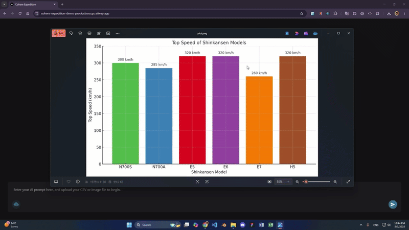

# Code-based Synthetic Multimodal Data Generation

A Next.js application developed for the Aya Expedition 2025, focusing on generating synthetic multimodal data for training and enhancing Visual Language Models (VLMs).

## Project Overview

### Research Question
We aim to develop an approach and pipeline for generating synthetic multimodal data to train, enhance, and evaluate multimodal models such as Visual Language Models (VLMs).

### Importance
High-quality, diverse datasets are essential for improving VLMs' understanding of both textual and visual information. Existing multimodal datasets lack structured chart/plot-based data, which limits their visualization understanding. Synthetic data generation enables us to create a diverse dataset scalably while reducing costs and biases.

## Features

- CSV data visualization and chart generation
- Image analysis and understanding
- Interactive data selection and manipulation
- Multiple chart type support (bar, line, scatter, pie, area, histogram)
- Secure API key management
- Real-time chart generation and preview




## Team Members

- **Avneet Kaur** - [LinkedIn](https://www.linkedin.com/in/avneetkaur97/)
- **Dante Lok** - [LinkedIn](https://www.linkedin.com/in/dante-lok-2a09a5146/)
- **Reuben Chagas Fernandes** - [LinkedIn](https://www.linkedin.com/in/reuben-chagas-fernandes/)

## Getting Started

### Prerequisites

- Node.js 18.x or later
- npm or yarn
- Cohere API key

### Installation

1. Clone the repository:
```bash
git clone [repository-url]
cd [repository-name]
```

2. Install dependencies:
```bash
npm install
# or
yarn install
```

3. Run the development server:
```bash
npm run dev
# or
yarn dev
```

4. Open [http://localhost:3000](http://localhost:3000) with your browser to see the application.

## Usage

1. Enter your Cohere API key in the input field
2. Upload a CSV file or image
3. For CSV files:
   - Select columns and rows
   - Choose chart types
   - Generate visualizations
4. For images:
   - Get AI-powered analysis
   - View Q&A pairs about the image

## Technologies Used

- Next.js 14
- React
- TypeScript
- Tailwind CSS
- Cohere AI API
- Matplotlib (for chart generation)


