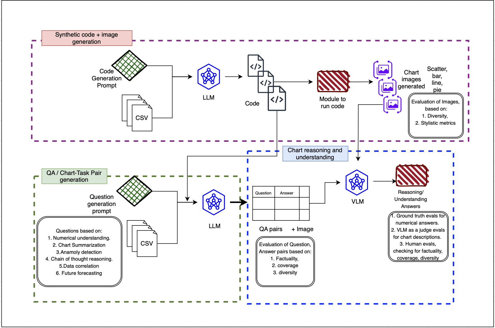
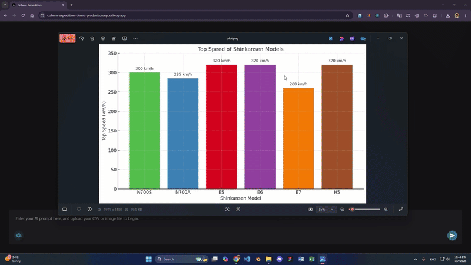
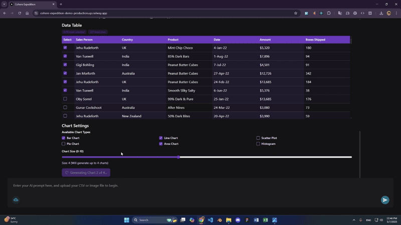

# Code-based Synthetic Multimodal Data Generation

Generate **synthetic chart-and-QA datasets** to train and evaluate Vision-Language Models (VLMs) — using an LLM to write real plotting code, execute it, and then judge the results with a VLM.

> Built for the **Cohere Aya Expedition 2025**. Runs entirely on your own machine with your own Cohere API key — nothing is hosted, nothing leaves your laptop except the API calls you make.



---

## Why this exists

High-quality multimodal datasets rarely contain structured **chart/plot** data, which limits how well VLMs understand visualizations. Instead of scraping or hand-labeling, this project **generates** the data:

1. An LLM writes Python (matplotlib/seaborn) code to plot a real CSV.
2. The code is executed to render an actual chart image.
3. An LLM generates question–answer pairs grounded in the same data.
4. A **VLM-as-judge** (Aya Vision) checks whether the QA pairs are answerable and correct from the chart.

The result is a scalable, low-cost, diverse dataset — plus an automated quality filter.

## Demo




---

## Two ways to run

This repo contains **two independent parts**. Most people want the first one.

| | What it is | Needs |
|---|---|---|
| **1. The web app** | Interactive chat UI: upload a CSV or image, pick chart types, generate charts in your browser | **Node.js only** (Python runs in-browser via Pyodide) |
| **2. The research pipeline** | Batch scripts that generate + evaluate a full dataset from the command line | **Python** + a Cohere API key |

You need a free Cohere API key for either: <https://dashboard.cohere.com/api-keys>

---

## 1. Run the web app

**Prerequisites:** Node.js 18.17+ and npm.

```bash
git clone <repository-url>
cd Code-based-Synthetic-Multimodal-Data-Generation

npm install
npm run dev
```

Open <http://localhost:3000>. You should see a greeting and a prompt box.

**Try it in 30 seconds:**
1. Paste your Cohere API key into the key field (it stays in your browser — it is never committed or sent anywhere except Cohere).
2. Upload a CSV — a sample lives at `data/covid-19-dataset/country_wise_latest.csv`.
3. Select rows/columns and chart types, then generate. Charts render in-browser.

Image mode: upload an image instead to get VLM analysis and auto-generated Q&A pairs.

---

## 2. Run the research pipeline

**Prerequisites:** Python 3.10+.

```bash
# from the repo root
python -m venv .venv
source .venv/bin/activate        # Windows: .venv\Scripts\activate
pip install -r requirements.txt

# provide your key (either export it, or use a .env file)
cp .env.example .env             # then edit .env and paste your key
```

The pipeline is a command-line tool (`main.py`) with four subcommands:

```bash
# Full pipeline: generate charts -> generate QA pairs -> evaluate
python main.py run --csv data/covid-19-dataset/usa_county_wise.csv

# Or run stages individually:
python main.py charts --chart-types "Bar Chart" "Line Chart" --output-size 4
python main.py qa --output-size 8
python main.py evaluate            # scores artifacts from a previous run

python main.py --help              # all commands
python main.py run --help          # all flags for a command
```

Common flags: `--csv`, `--output-dir`, `--batch-size`, `--output-size`, `--model`,
`--vlm-model`, `--max-retries`, `--seed`, `-v/--verbose`. Defaults produce the sample
COVID-19 dataset run, so `python main.py run` works out of the box once your key is set.

Under the hood:

- `src/generation.py` — LLM calls: `generate_code_block(...)` (chart code) and `generate_qa_pairs(...)`
- `src/evaluation.py` — heuristic chart/QA scoring and `vlm_evaluation(...)` (VLM-as-judge)
- `src/pipeline.py` — orchestration: retries, logging, and on-disk output layout
- `src/utils.py` — helpers (e.g. stripping markdown fences from LLM output)

Outputs are written under `--output-dir` (default `generated/`):

```
generated/
├── cohere_chart_datasets/   # rendered chart images (.png)
├── chart_code/              # the LLM-generated code for each chart type
└── qa_pairs.json            # generated QA pairs (a sample is committed)
```

> ⚠️ **Security:** the pipeline executes LLM-generated Python with `exec()`. In the web app this is sandboxed by Pyodide, but the Python pipeline runs it in your local process. Only run it on data and prompts you trust. Hardening this (restricted namespace, timeouts, subprocess isolation) is on the roadmap.

---

## Project structure

```
app/            Next.js web app (chat UI, in-browser Pyodide chart execution)
src/            Python research pipeline (generation, evaluation, pipeline, utils, notebook)
data/           Sample source datasets (COVID-19)
generated/      Pipeline outputs (chart images are git-ignored; qa_pairs.json kept as a sample)
images/         README assets (pipeline diagram, demo GIFs)
main.py         Pipeline CLI entrypoint (charts / qa / evaluate / run)
```

## Tech stack

- **App:** Next.js 15, React 19, TypeScript, Tailwind CSS, Pyodide (in-browser Python)
- **Pipeline:** Python, pandas, matplotlib, seaborn
- **Models:** Cohere `command-a-03-2025` (code + QA), `c4ai-aya-vision-32b` (VLM judge)

## Roadmap

This project is being hardened from a hackathon prototype toward a polished open-source tool. Planned work:

- [x] Remove hardcoded API keys; load from environment / `.env`
- [x] Stop committing generated images; pin Python dependencies
- [x] Turn the pipeline into a configurable CLI (no more editing globals)
- [ ] Sandbox `exec()` of generated code (restricted namespace + timeout)
- [ ] Tests (pytest) and CI (lint, typecheck, build)
- [ ] Refactor the large `AiMessage` component into focused hooks/components
- [ ] Replace substring-based evaluation heuristics with stronger metrics
- [ ] Publish the generated dataset with a dataset card

## Team

- **Avneet Kaur** — [LinkedIn](https://www.linkedin.com/in/avneetkaur97/)
- **Dante Lok** — [LinkedIn](https://www.linkedin.com/in/dante-lok-2a09a5146/)
- **Reuben Chagas Fernandes** — [LinkedIn](https://www.linkedin.com/in/reuben-chagas-fernandes/)

## License

No license file is present yet. Until one is added, all rights are reserved — adding an OSI license (e.g. MIT) is on the roadmap so others can freely use and contribute.
