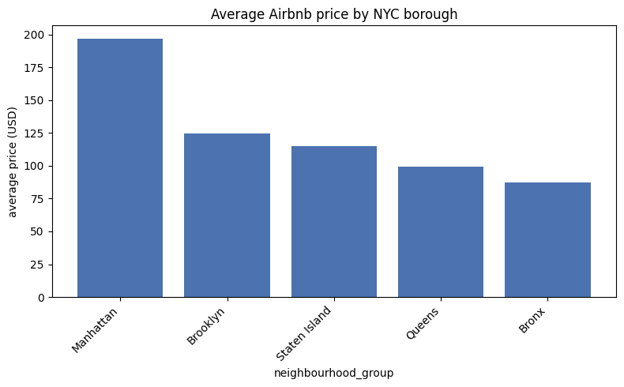
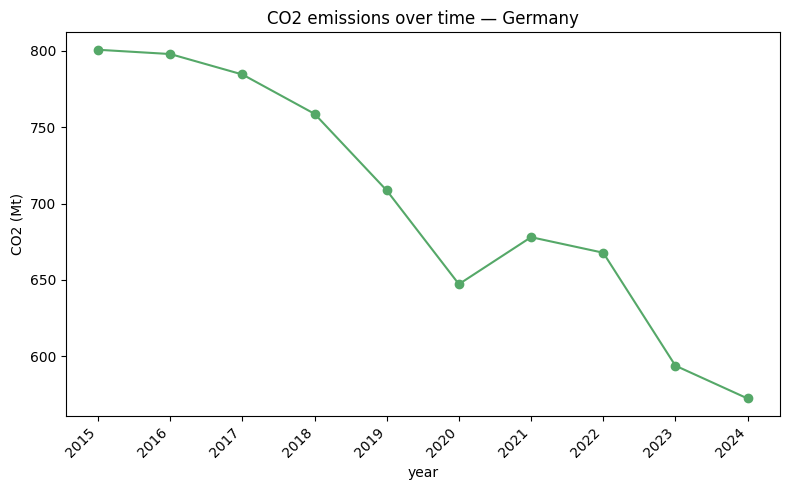

# Code-based Synthetic Multimodal Data Generation

[](https://github.com/dantelok/Code-based-Synthetic-Multimodal-Data-Generation/actions/workflows/ci.yml)
[](https://huggingface.co/datasets/dantelok/multidomain-chart-qa)
[](LICENSE)

**Generate synthetic chart-and-QA data to train and evaluate Vision-Language Models (VLMs)** — write real plotting code, render actual charts, and pair them with question–answer labels that are *computed from the data*, not guessed.

The result is a published, multi-domain dataset with **verifiable labels**:
[🤗 dantelok/multidomain-chart-qa](https://huggingface.co/datasets/dantelok/multidomain-chart-qa) — ~12,600 QA over ~1,800 charts.

> Originally built for the **Cohere Aya Expedition 2025**, then hardened into a polished, tested open-source project.


## Highlights

- ✅ **Verifiable labels** — answers are computed from the underlying data with pandas, so they're correct *by construction* (a "total" is really the total, a "max" is really the max).
- 🖼️ **Real chart images** — charts are produced by executing plotting code, not faked; the dataset build renders them deterministically so every question is answerable from the image.
- 🧑‍⚖️ **VLM-as-judge** — a vision model scores generated QA and returns structured per-item verdicts (`answer_correct` / `question_relevant`).
- 🌍 **Multi-domain** — climate, e-commerce, and housing, from three CC BY 4.0 sources.
- 💻 **Reproducible pipeline** — a seeded Python CLI builds the entire dataset offline; a browser demo is included as an optional extra.
- 🔒 **Safe by design** — generated code runs sandboxed (in-browser via Pyodide, or an isolated subprocess with timeouts).
- ✔️ **Production hygiene** — typed frontend, tested Python, green CI, MIT-licensed.

## Example

Charts rendered by the pipeline, each with a ground-truth answer computed from the same data slice:

|  |  |
|:---:|:---:|
| **Q:** Which NYC borough has the highest average listing price?<br>**A:** Manhattan (\$196.88) | **Q:** In which year were Germany's CO₂ emissions highest?<br>**A:** 2015 (800.8 Mt) |

---

## Why this exists

High-quality multimodal datasets rarely contain structured **chart/plot** data, which limits how well VLMs understand visualizations. Instead of scraping or hand-labeling, this project **generates** the data end to end:

1. Plotting code is written (by an LLM) and **executed** to render an actual chart image.
2. Question–answer pairs are generated **grounded in the same data**.
3. A **VLM-as-judge** checks whether each answer is correct and each question is relevant to the chart.

For the published dataset, answers are computed programmatically from the data — the same approach behind chart-QA benchmarks like DVQA, FigureQA, and PlotQA — so the labels are trustworthy, not just plausible.

---

## The pipeline

The core of the project is a Python command-line pipeline that generates charts, produces ground-truth QA, evaluates them with a VLM judge, and builds the published dataset.

**Prerequisites:** Python 3.10+.

```bash
python -m venv .venv
source .venv/bin/activate        # Windows: .venv\Scripts\activate
pip install -r requirements.txt

cp .env.example .env             # then add your Cohere API key
```

`main.py` has four subcommands:

```bash
# Full pipeline: generate charts -> QA pairs -> evaluate
python main.py run --csv data/covid-19-dataset/usa_county_wise.csv

# Or run stages individually:
python main.py charts --chart-types "Bar Chart" "Line Chart" --output-size 4
python main.py qa --output-size 8      # ground-truth QA, computed from data (no API key)
python main.py evaluate                # scores artifacts from a previous run

python main.py --help                  # all commands and flags
```

Common flags: `--csv`, `--output-dir`, `--batch-size`, `--output-size`, `--model`, `--vlm-model`, `--max-retries`, `--seed`, `-v/--verbose`. A free Cohere API key (for the LLM/VLM stages): <https://dashboard.cohere.com/api-keys>.

<details>
<summary><b>Optional: interactive web demo</b></summary>

A small Next.js app lets you try the idea in a browser — upload a CSV or image, pick chart types, and generate charts in-browser (Python runs via Pyodide). It's a demo, not the core contribution.

```bash
npm install && npm run dev      # needs Node.js 18.17+, then open http://localhost:3000
```

Paste your Cohere API key (it stays in your browser), upload a CSV (sample: `data/covid-19-dataset/country_wise_latest.csv`), and generate. Image mode gives VLM analysis + auto-generated Q&A.
</details>

---

## Ground-truth QA labels

By default (`--qa-method grounded`) answers are **computed from the data** with pandas and filled into question templates, so every label is correct by construction — for a column `cases = [100, 250, 400]`, "total" is `750` and "max" is `400`, never a plausible-but-wrong LLM guess. Grounded QA needs no API key. Pass `--qa-method llm` to instead have the model write answers (convenient, but *not* guaranteed correct).

The VLM judge returns structured per-QA verdicts (`answer_correct` / `question_relevant`), which the pipeline aggregates into a summary (mean answer accuracy and relevance).

> ⚠️ **Executing generated code.** The pipeline runs LLM-generated Python in an isolated subprocess with a wall-clock timeout (and a CPU-time limit on POSIX), so a hang or crash is bounded. It is *not* a full security sandbox — only run it on data and prompts you trust. (The web app runs generated code in the browser via Pyodide, which is sandboxed.)

---

## The dataset

`build_hf_dataset.py` assembles the **multi-domain chart-QA dataset with verifiable labels**. For each source it renders charts deterministically and generates ground-truth QA over the *same* slice — entirely offline, no API key — so every answer is answerable from the image.

```bash
pip install -r requirements-dataset.txt

# download the CC BY 4.0 sources into data/sources/ first (see DATASET_CARD.md):
#   owid-co2-data.csv · online_retail.csv · listings.csv
python build_hf_dataset.py --source-dir data/sources --charts-per-domain 600 --seed 0 \
    --hf-out generated/hf_dataset --push <user>/<dataset-name>
```

**Published:** [🤗 dantelok/multidomain-chart-qa](https://huggingface.co/datasets/dantelok/multidomain-chart-qa) — ~12,600 QA over ~1,800 charts (bar / pie / line / scatter), balanced across climate, e-commerce, and housing, split 90/10 train/test. Full schema, attribution, and limitations are in [`DATASET_CARD.md`](DATASET_CARD.md).

---

## Project structure

```
app/            Next.js web app (chat UI, in-browser Pyodide chart execution)
src/            Python pipeline (generation, evaluation, metrics, qa_templates, render, utils)
data/           Sample source dataset (COVID-19)
main.py         Pipeline CLI entrypoint (charts / qa / evaluate / run)
build_hf_dataset.py   Multi-domain dataset builder
DATASET_CARD.md       Hugging Face dataset card
```

## Tech stack

- **App:** Next.js 15, React 19, TypeScript, Tailwind CSS, Pyodide (in-browser Python)
- **Pipeline:** Python, pandas, matplotlib, seaborn
- **Models:** Cohere `command-a-03-2025` (code + QA) and `command-a-vision-07-2025` (VLM judge)

## Development

```bash
pip install -r requirements-dev.txt   # runtime deps + pytest + ruff

pytest          # test suite (no API key needed)
ruff check .    # lint the Python code
```

CI (GitHub Actions) runs Python lint + tests and the web app's lint + build on every push and pull request — see [`.github/workflows/ci.yml`](.github/workflows/ci.yml).

## Team

- **Dante Lok** — Project Lead — [LinkedIn](https://www.linkedin.com/in/dante-lok-2a09a5146/)
- **Avneet Kaur** — [LinkedIn](https://www.linkedin.com/in/avneetkaur97/)
- **Reuben Chagas Fernandes** — [LinkedIn](https://www.linkedin.com/in/reuben-chagas-fernandes/)

## Acknowledgements

The published dataset is built from three openly-licensed sources (all **CC BY 4.0**):

- [Our World in Data — CO₂ and Greenhouse Gas Emissions](https://github.com/owid/co2-data) (climate)
- [UCI Machine Learning Repository — Online Retail](https://archive.ics.uci.edu/dataset/352/online+retail) (e-commerce)
- [Inside Airbnb](https://insideairbnb.com/get-the-data/) (housing)

## License

Released under the [MIT License](LICENSE) — free to use, modify, and distribute. The sample COVID-19 data under `data/` and the dataset sources above remain under their original terms.
